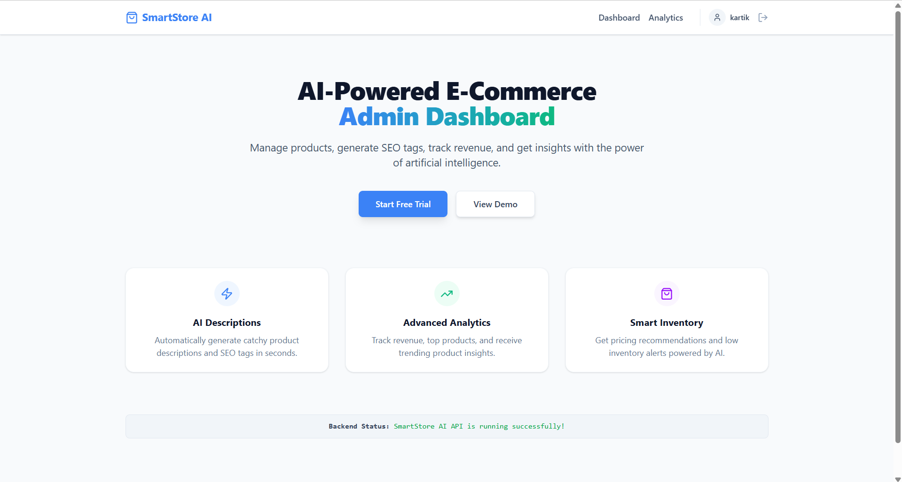
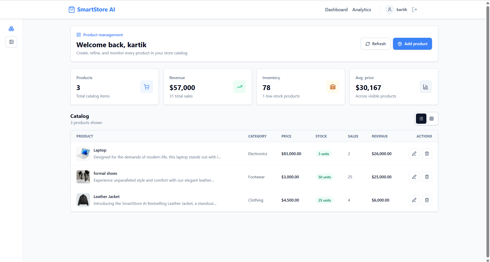
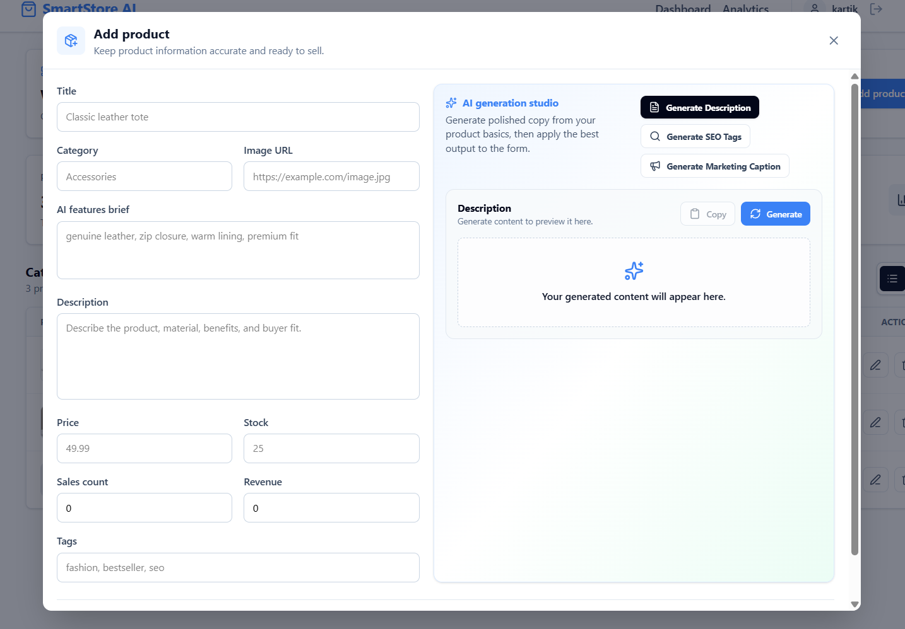
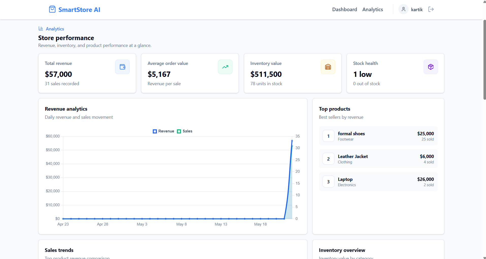
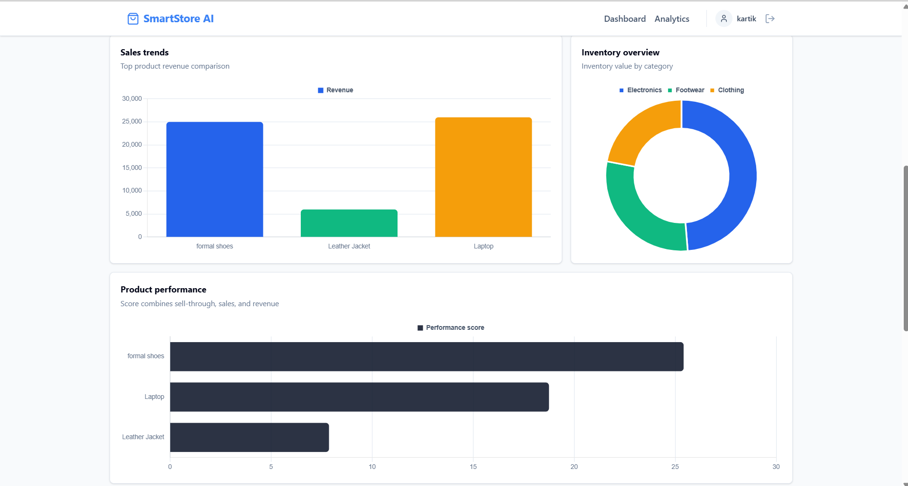
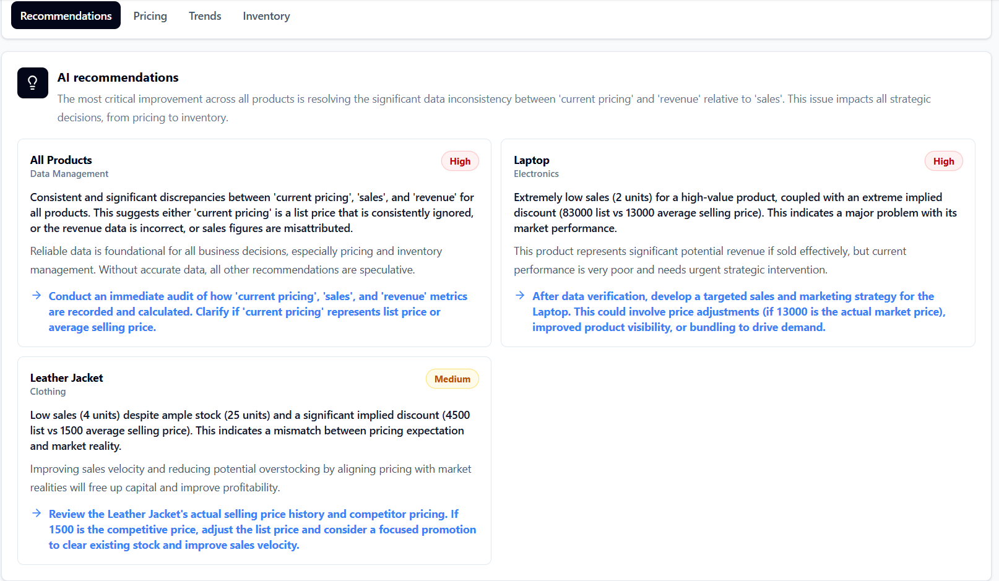
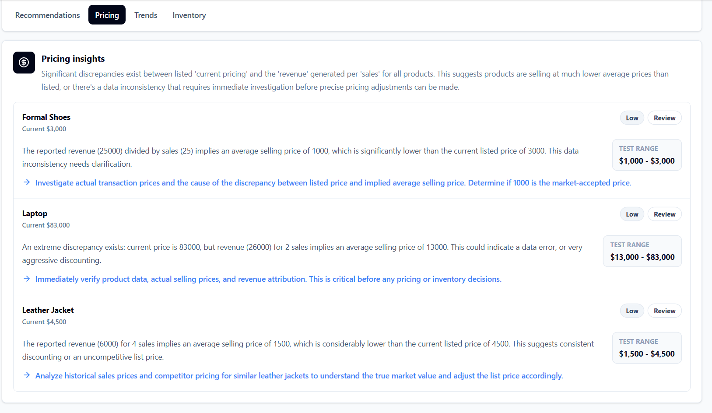
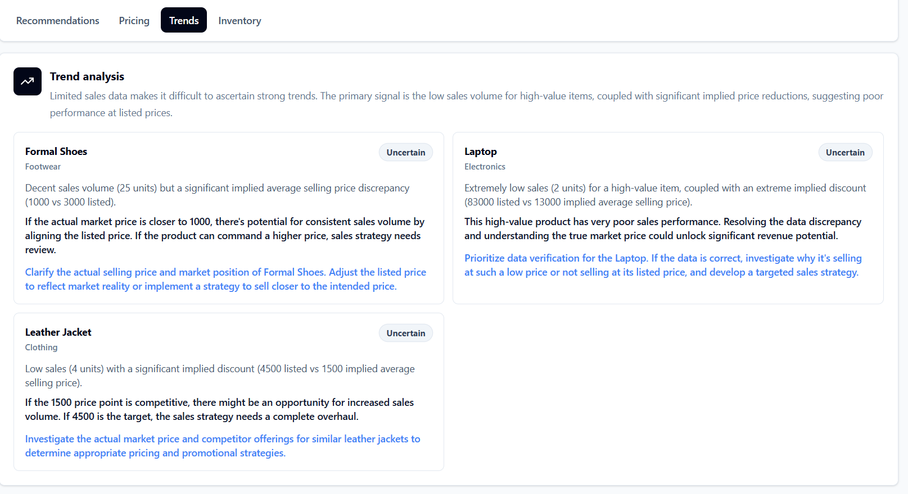
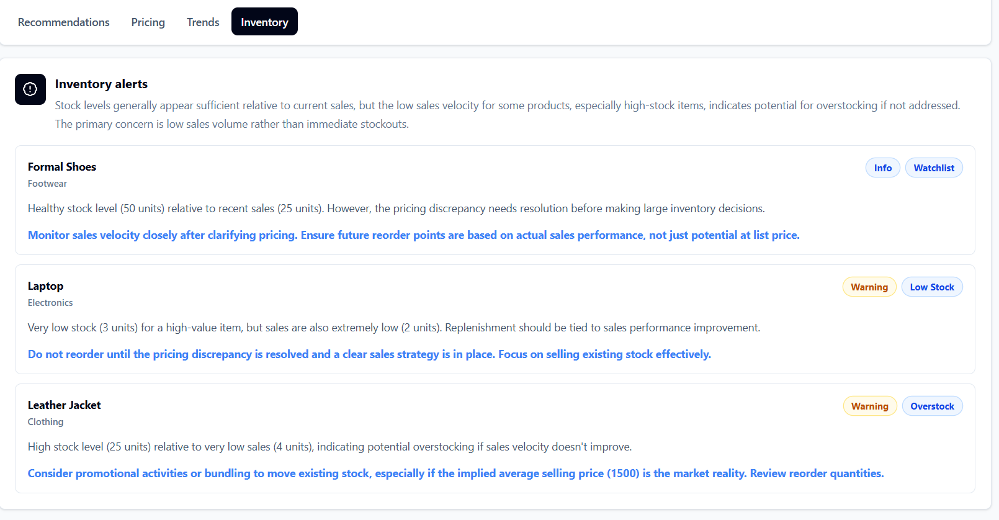

# SmartStore AI

SmartStore AI is a full-stack e-commerce admin dashboard built for product management, AI-assisted product content, analytics, and AI-powered business insights.

The project currently includes:

- User authentication with HTTP-only JWT cookies.
- Product CRUD with searching, filtering, validation, and ownership protection.
- Gemini-powered product copy generation for descriptions, SEO tags, and marketing captions.
- Analytics APIs and a dedicated analytics frontend page with charts.
- Gemini-powered business insights for pricing, product trends, inventory risk, and product improvement suggestions.

## Landing Page



## Product Management Dashboard



## Product Form With AI Generation Studio



## Analytics Dashboard




## AI Business Insights Panel






## Tech Stack

### Frontend

- React
- Vite
- Tailwind CSS
- React Router
- Zustand
- Axios
- Lucide React
- Chart.js
- React Chart.js 2

### Backend

- Node.js
- Express
- MongoDB
- Mongoose
- Cookie Parser
- CORS
- JSON Web Tokens
- bcryptjs
- Gemini API through REST requests

## Project Structure

```txt
.
|-- client/
|   |-- src/
|   |   |-- components/
|   |   |   |-- dashboard/
|   |   |-- pages/
|   |   |-- services/
|   |   |-- store/
|   |   |-- App.jsx
|   |   `-- main.jsx
|   `-- package.json
|-- server/
|   |-- config/
|   |-- controllers/
|   |-- middleware/
|   |-- models/
|   |-- routes/
|   |-- services/
|   |-- utils/
|   |-- server.js
|   `-- package.json
|-- package.json
`-- README.md
```

## Current Frontend Pages

### Landing Page

Route:

```txt
/
```

The landing page introduces SmartStore AI and checks whether the backend test API is reachable.

### Authentication Pages

Routes:

```txt
/login
/signup
```

Login and signup use the backend authentication APIs. Authentication state is stored on the client with Zustand, while the JWT itself is stored as an HTTP-only cookie by the backend.

### Product Management Dashboard

Route:

```txt
/dashboard
```

The product dashboard includes:

- Product table view.
- Product card view.
- Add product modal.
- Edit product modal.
- Delete product flow.
- Search field.
- Category filter.
- Tag filter.
- Price range filters.
- Stock availability filter.
- Sort controls.
- Collapsible filter sidebar.
- Loading states and toast notifications.

### Analytics Page

Route:

```txt
/analytics
```

The analytics page includes:

- Revenue analytics chart.
- Sales trend chart.
- Top products widget.
- Inventory overview chart.
- Product performance chart.
- Analytics stat cards.
- AI business insights panel.

## Authentication

Authentication is implemented with JWT cookies.

### Flow

1. A user signs up or logs in.
2. The backend creates a signed JWT.
3. The JWT is stored in an HTTP-only cookie named `jwt`.
4. Protected routes read and verify that cookie.
5. The frontend checks the current session through `/api/auth/me` when the app loads.

### Auth Backend Files

- `server/controllers/authController.js`
- `server/routes/authRoutes.js`
- `server/middleware/authMiddleware.js`
- `server/utils/generateToken.js`
- `server/models/User.js`

## Product Management

Product management is the main CRUD feature of the application.

### Product Fields

The product model contains:

- `title`
- `description`
- `category`
- `price`
- `stock`
- `tags`
- `salesCount`
- `revenue`
- `image`
- `createdBy`
- `createdAt`
- `updatedAt`

### Product Backend Behavior

The backend includes:

- Schema validation.
- Auth protection.
- Per-user ownership checks.
- Product searching.
- Product filtering.
- Sorting.
- Pagination.
- Clean success and error responses.

### Product Filters

Supported product list query parameters:

```txt
search
category
tag
minPrice
maxPrice
minStock
maxStock
inStock
sortBy
sortOrder
page
limit
```

### Product Backend Files

- `server/models/Product.js`
- `server/services/productService.js`
- `server/controllers/productController.js`
- `server/routes/productRoutes.js`

## AI Product Content Generation

The product form includes an AI generation studio powered by Gemini.

### Product AI Tools

The current tools generate:

- SEO-friendly product descriptions.
- Searchable SEO tags.
- Marketing captions.

### Product AI Inputs

The AI content generator uses:

- Product title.
- Product category.
- Feature brief.
- Product price.

### Product AI Frontend Behavior

The frontend supports:

- Generate actions.
- Regenerate actions.
- Loading animations.
- Error messages.
- Copy-to-clipboard.
- Auto-fill for generated product descriptions.
- Auto-fill for generated SEO tags.

### Product AI Backend Files

- `server/services/aiService.js`
- `server/controllers/aiController.js`
- `server/routes/aiRoutes.js`

### Product AI Frontend Files

- `client/src/components/dashboard/AIGeneratorPanel.jsx`
- `client/src/services/aiApi.js`
- `client/src/components/dashboard/ProductModal.jsx`

## Analytics System

The analytics backend uses MongoDB aggregation pipelines over product data.

### Analytics Features

The implemented analytics system includes:

- Total revenue metrics.
- Top selling products.
- Inventory statistics.
- Product performance metrics.
- Category breakdowns.
- Sales trend series.

### Analytics Data Note

The current project does not contain an orders collection. Sales trend data is therefore derived from existing product `salesCount`, `revenue`, and product creation dates so the analytics UI has chart-friendly trend data based on the available product metrics.

### Analytics Frontend Files

- `client/src/pages/AnalyticsPage.jsx`
- `client/src/components/dashboard/AnalyticsDashboard.jsx`
- `client/src/services/analyticsApi.js`

### Analytics Backend Files

- `server/services/analyticsService.js`
- `server/controllers/analyticsController.js`
- `server/routes/analyticsRoutes.js`

## AI Business Insights

The analytics page includes a business insights panel powered by Gemini.

### Insight Features

The business insights backend generates:

- Pricing recommendations.
- Trending product insights.
- Inventory alerts.
- Product improvement suggestions.

### Insight Inputs

Business insight requests use product metric inputs:

- Sales.
- Stock.
- Revenue.
- Category.
- Pricing.
- Product title.

### Insight UI Behavior

The AI insights panel:

- Uses analytics product performance data as input.
- Generates insights through a deliberate user action.
- Uses one summary insight request for the panel view.
- Shows tabs for recommendations, pricing, trends, and inventory.
- Displays badges, risk indicators, and action text.

### Business Insights Frontend Files

- `client/src/components/dashboard/AIInsightsPanel.jsx`
- `client/src/services/aiInsightsApi.js`

### Business Insights Backend Files

- `server/services/aiInsightsService.js`
- `server/controllers/aiInsightsController.js`
- `server/routes/aiInsightsRoutes.js`

## API Routes

All routes below are implemented in the backend.

### Test API

```txt
GET /api/test
```

### Authentication APIs

```txt
POST /api/auth/register
POST /api/auth/login
POST /api/auth/logout
GET  /api/auth/me
```

### Product APIs

```txt
POST   /api/products
GET    /api/products
GET    /api/products/:id
PUT    /api/products/:id
DELETE /api/products/:id
```

### AI Product Content APIs

```txt
POST /api/ai/description
POST /api/ai/tags
POST /api/ai/captions
```

### Analytics APIs

```txt
GET /api/analytics/dashboard
GET /api/analytics/revenue
GET /api/analytics/top-products
GET /api/analytics/sales-trends
GET /api/analytics/inventory
GET /api/analytics/product-performance
GET /api/analytics/categories
```

### AI Business Insights APIs

```txt
POST /api/ai-insights/summary
POST /api/ai-insights/pricing
POST /api/ai-insights/trending-products
POST /api/ai-insights/inventory-alerts
POST /api/ai-insights/product-improvements
```

## API Response Style

Successful backend responses use a consistent structure:

```json
{
  "success": true,
  "message": "Request completed successfully",
  "data": {}
}
```

Some responses also include `meta`, for example analytics metadata or AI provider/model metadata.

Error responses use:

```json
{
  "success": false,
  "message": "Error message"
}
```

Validation errors can additionally include an `errors` array.

## Setup

### Prerequisites

- Node.js
- npm
- MongoDB available through the configured MongoDB URI
- Gemini API key for AI features

### Install Dependencies

Install root dependencies:

```bash
npm install
```

Install backend dependencies:

```bash
cd server
npm install
```

Install frontend dependencies:

```bash
cd ../client
npm install
```

Return to the project root:

```bash
cd ..
```

## Environment Variables

Create or update `server/.env` with the backend environment variables.

```env
PORT=5000
MONGO_URI=mongodb://localhost:27017/smartstore-ai
JWT_SECRET=replace_with_your_jwt_secret
CLIENT_URL=http://localhost:5173
GEMINI_API_KEY=replace_with_your_gemini_api_key
GEMINI_MODEL=gemini-2.5-flash
```

The current AI product content generator and AI business insights system both use Gemini configuration from the server environment.

## Running The Project

From the project root, run both frontend and backend:

```bash
npm start
```

The root scripts start:

- Backend dev server from `server`.
- Frontend Vite dev server from `client`.

The frontend API client is configured to call:

```txt
http://localhost:5000/api
```

The frontend dev server uses Vite and is typically available at:

```txt
http://localhost:5173
```

## Implemented Frontend Reusable Components

Dashboard-related reusable components currently include:

- `Navbar`
- `ProtectedRoute`
- `PublicRoute`
- `Sidebar`
- `ProductTable`
- `ProductCards`
- `ProductModal`
- `ToastStack`
- `AIGeneratorPanel`
- `AnalyticsDashboard`
- `AIInsightsPanel`

## Notes

- Protected backend routes require an authenticated user cookie.
- Product CRUD and analytics data are scoped to the authenticated user's products.
- Gemini quota and rate limits can affect AI generation requests.
- `server/.env` is ignored by git.
